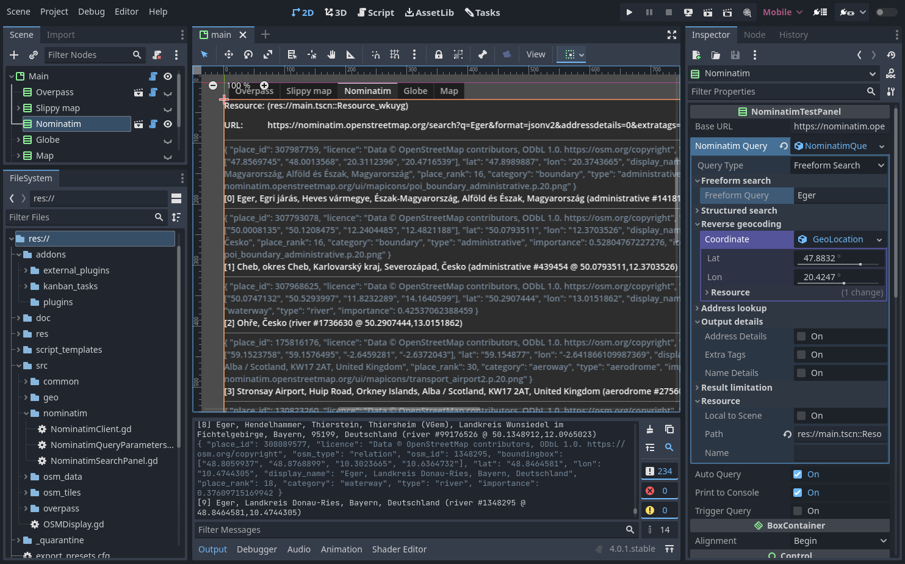

# godot-osm
 
Godot project around [OpenStreetMap](https://www.openstreetmap.org) ecosystem.

It just for personal interest, but everything is done in a way to provide reusable components to the outside world...

Nominatim
--

A [Nominatim](https://nominatim.org) client is already inluded in a reusable form.

Nominatim is a service for searching in the OpenStreetMap database. OpenStreetMap also uses Nominatim for searching on their main map page.

With Nominatim your can make freeform search or structured search, which results in OpenStreetMap elements with names and coordinates, etc.
But you can also do geocoding, which is a reverse search, trying to return you what you can find in the world at a certian location.

You can define the search query parameters in a `NominatimQueryParameters` resource and pass it to a `NominatimClient` and get the result in JSON.

A `NominatimSearchPanel` GUI window is also provided. You can make freeform search with it, it handles all internal aspects of the user input and the search. It signals, if user clicked on any of the results. See below.

OpenStreetMap slippy map with prerendered tiles
--

A GUI element is also already usable, which displays a tilemap around a given location at a given zoom level.

The `OSMTileDisplay` deals with the user input for panning and zooming the map. In the background it uses a `OSMTileManager`, which receives requests for the tiles, requesting them from a map tile server, caching them to a given file location, and returning the tiles as `Image` objects in an async way via signals.

The `OSMTileDisplay` can zoom on a region via script function also. Connecting it to a `NominatimSearchPanel` with a few line of main script already results in a searchable and navigatable slippy map.

Upcoming
--

- Overpass query system, to retrieve data from the OSM database
- Fixes, enhancements of the above
- A way to extract/provide map data from the PSM data, which is suitable for further usage. e.g. object placement, path and mesh generation, etc.  
